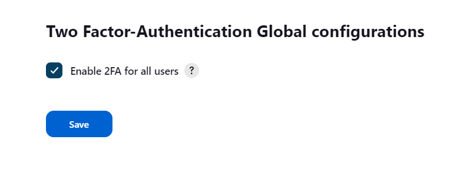
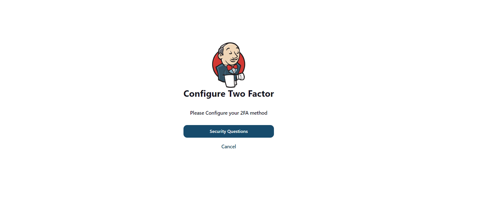
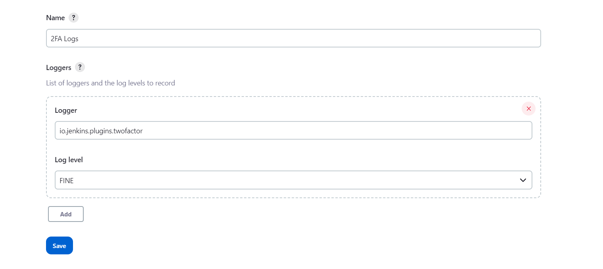

# Two-Factor Authentication for Jenkins

**Two-Factor Authentication for Jenkins** Plugin adds a layer of security to Jenkins authentication by requiring users
to provide a second factor of authentication along with their username and password.
It enhances the overall security of your Jenkins environment. Additionally, this plugin does not require you to extend the security realm, making it easier to implement and use.

**Supported Authentication method**

* Security Questions
* Mobile Authenticator [⭐⭐Coming soon]
* Yubikey hardware token [⭐⭐Coming soon]
* Duo Push Notification [⭐⭐Coming soon]
* OTP over email [⭐⭐Coming soon]
* OTP over SMS [⭐⭐Coming soon]
* Backup code [⭐⭐Coming soon]

# Installation Instructions

* Login to your Jenkins.
* Go to the **Manage Jenkins** option from the left panel, and open the **Manage Plugins** tab.
* Go to the **advanced** tab and upload the hpi file.
*  **⚠️   Make sure you restart the Jenkins**
* You can get the hpi file by running ```mvn clean package``` command on this code. Contact info@xecurify.com if you are
  facing any issues.


**Step 2: To activate the plugin**

* Open **Manage Jenkins** => **2FA Global Configurations** and check the **Enable 2FA for all users** checkbox.




# Setup Your 2FA

* After restarting the plugin again go to Manage Jenkins → 2FA Global configuration and check the checkbox **Enable for all users** to enable 2FA  in Jenkins for all users and save the configuration.
 


* Whenever a user signs in with Jenkins credentials, a 2FA configuration display will appear in Jenkins.



* Setup your security questions for 2FA.

# Reset Security methods

* Go to your user profile and click on the 2FA configuration button in the side panel. 


* Click on your security method and reconfigure accordingly.


# Troubleshooting and Logging

Refer below steps to generate error Logs and send it to info@xecurify.com. We will help you
resolve your issue in no time.

* Sign in to Jenkins as an admin and select Manage Jenkins from the left panel of the dashboard.
* Scroll down to find the System Log option.
* Click Add new Log Recorder button and add the log recorder name as 2FaLogs.
* Add **com.miniorange.twofactor.jenkins** as a Logger and select fine as a log level.
  
* Save the settings. 
* Perform 2FA on another browser/private window to record logs. 
* Visit the System Log option again and copy the recorded logs from the 2FaLogs logger. 
* Paste logs in a notepad/word file and send it to us. 
* You can even reach us at info@xecurify.com or raise a ticket using this [link](https://miniorange.atlassian.net/servicedesk/customer/portal/2%22).
